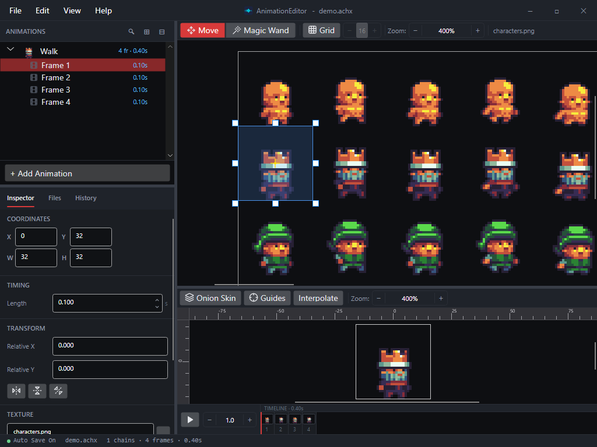

# Your First Animation

This walkthrough takes you from a sprite sheet PNG to a playable animation — a walking
character — in a few minutes. You'll create an animation, point its frames at cells of the
sheet, and watch it play.

By the end you'll have something like this:

## Before you start

You need a **sprite sheet** — a single PNG image that packs the frames of your animation into
a grid of equal-sized cells. Each cell is one frame of the motion (for a walk: contact,
passing, contact, passing). The editor never modifies your PNG; it just records which
rectangle of it each frame should show.

## The idea

An **animation** in the editor is an ordered list of **frames**. Each frame points at a
rectangular region of a texture and stays on screen for a set duration. Play the frames in
order and the character moves. That's the whole model — everything below is just filling in
those two things: which region, and for how long.

## Steps

### 1. Add an animation

In the **ANIMATIONS** panel on the left, click **+ Add Animation**. A new animation appears
and drops into rename mode — type a name like `Walk` and press Enter.

### 2. Bring in your sprite sheet

Drag your sprite-sheet PNG from your file explorer onto the new animation in the tree. The
editor adds a first frame that references the image, and the sheet appears in the **Wireframe**
panel (top). Use the mouse wheel to zoom and drag to pan if you need a closer look.

### 3. Frame the first cell

That first frame currently covers the *whole* sheet. Shrink it to a single cell:

1. Turn on **Grid** in the wireframe toolbar and set the cell size to match your sheet (for a
   32×32 grid, enter `32`). Snapping makes the next part exact.
2. With the **Move** tool, drag the frame's edges so the selection box hugs the first cell of
   your animation.

The **Inspector** (bottom-left) shows the region's **X / Y / W / H** as you go — handy for
confirming you're on a clean cell boundary. The **Texture Coordinates** page covers the full
set of region-editing tools.

### 4. Add the rest of the frames

Right-click the animation and choose **Add Multiple Frames…**. Enter how many more frames the
cycle needs and leave **Increment UV** checked — the editor steps the region across the sheet
one cell at a time, so each new frame lands on the next cell of the row automatically.

> Prefer to place frames by hand, or your cells aren't in a neat row? The **Building Animation
> Chains** page covers the other ways to add frames.

### 5. Watch it play

Click the animation's name in the tree. The **Preview** panel (bottom) starts playing it
automatically. Use the **Play / Pause** button (or the **Space** bar) to stop and start, and
the speed box next to it to slow the motion down while you check it.

### 6. Adjust the timing

If the walk is too fast or too slow, select a frame and change **Length** (in seconds) in the
Inspector's **TIMING** section — a new frame defaults to `0.100`. To retime the whole animation
at once, right-click it and choose **Adjust Frame Time…**.

## What you built

You now have a reusable animation: an ordered set of frames, each cropped to a cell of your
sheet, playing at a set speed. Save it with **File ▸ Save** and it's ready for a game runtime
to load.

## Next steps

Once these pages are written they'll be linked here. For now, the topics to explore next:

- **Building Animation Chains** — faster ways to create frames: drag-drop variants, magic-wand
  region select, and duplicating a chain (including auto-mirrored directions).
- **Texture Coordinates** — precise region editing, flipping, and grid snapping.
- **Timing** — per-frame and whole-animation duration in depth.
